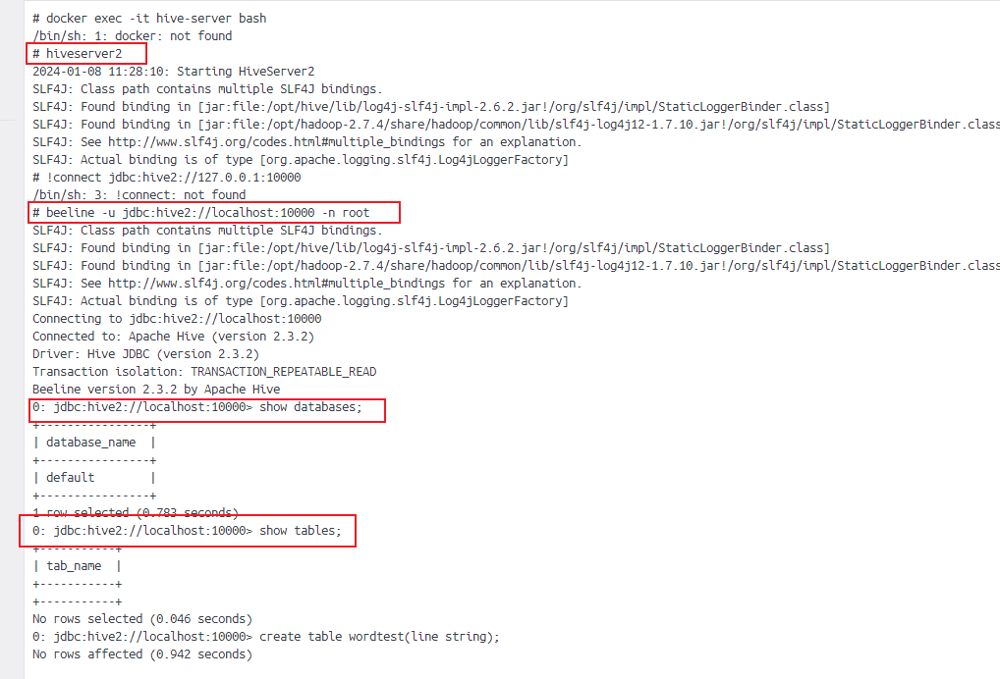
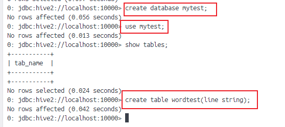
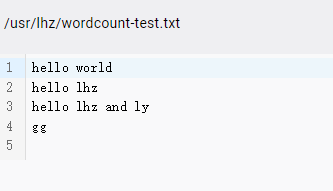
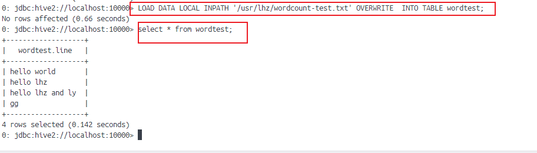
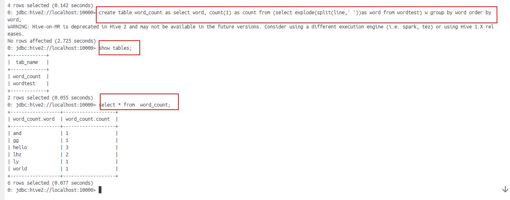
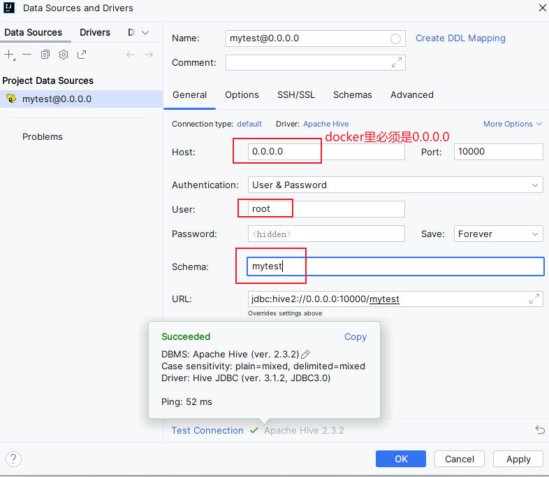
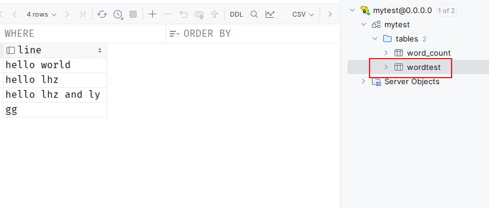
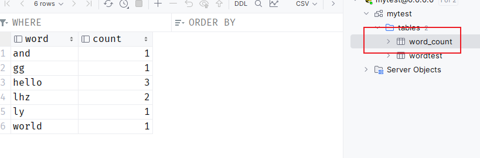

# HIVE实践

使用hiveserver2的beeline连接数据库



```
//启动服务
hiveserver2

//使用beeline连接hive数据库
beeline -u jdbc:hive2://localhost:10000 -n root

//数据库
jdbc:hive2://localhost:10000> show databases


```


使用自己的数据库




准备一个字符串文件



把本地的文件加载到表中




使用sql执行mapreduce，把结果存入word_count表中，并查看结果



使用datagridp可视化工具连接hive





